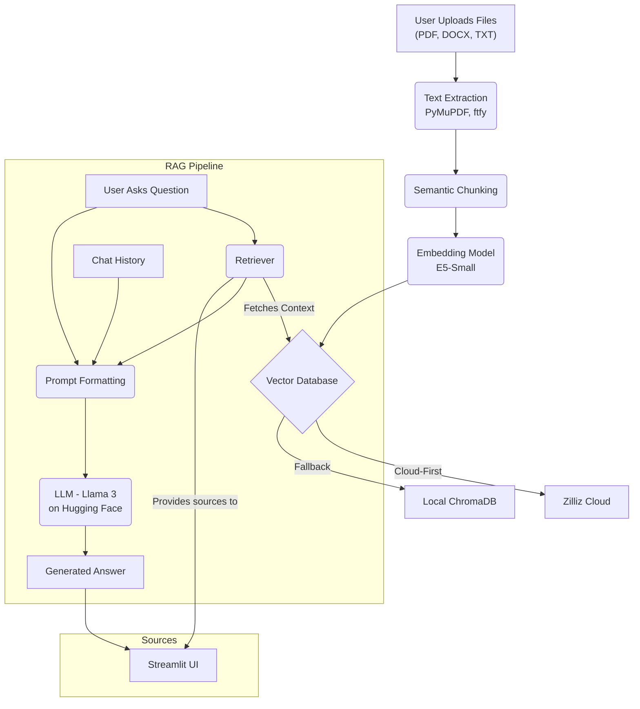

# Advanced RAG System for Conversational Document Analysis


An end-to-end, cloud-first RAG application that transforms multiple documents into a persistent, intelligent, and interactive knowledge base, complete with a robust local fallback system and source-cited answers for trustworthiness.

---


### System Architecture


## 📖 Project Overview

This project implements a sophisticated **Retrieval-Augmented Generation (RAG)** pipeline, engineered to be a scalable and reliable service, not just a simple demo. It allows users to build a cumulative knowledge base from various document formats (`.pdf`, `.docx`, `.txt`) and engage in complex, context-aware conversations.

The core philosophy is to build a system that is **robust, efficient, and trustworthy**. Every technical choice, from the data ingestion pipeline to the cloud architecture, was made to reflect professional software engineering standards.

## 🧠 Architecture & Features Deep Dive

This system is more than a simple script; it's a multi-layered application with a clear separation of concerns.

### 1. Robust Data Ingestion & Processing
The quality of a RAG system is defined by the quality of its data pipeline. This pipeline is designed to handle real-world, often messy, documents.

-   **Multi-Format Text Extraction**: Utilizes **PyMuPDF (`fitz`)** for its superior performance in accurately parsing complex PDF layouts, alongside handlers for DOCX and TXT files.
-   **Aggressive Text Sanitization**: Employs the **`ftfy`** library to fix encoding errors, remove garbage characters, and normalize text. This crucial step prevents downstream errors and ensures the models receive clean, high-quality input.
-   **Context-Aware Semantic Chunking**: Instead of naive, fixed-size splitting, the pipeline uses `SemanticChunker`. This advanced technique splits text based on semantic similarity between sentences, ensuring that coherent thoughts and paragraphs remain intact, which dramatically improves retrieval accuracy.

### 2. Cloud-First, Resilient Architecture
To ensure the application is both powerful and always available, it's built with a hybrid cloud architecture.

-   **Persistent Cloud Storage**: The primary vector database is **Zilliz Cloud**, a scalable, production-grade managed service. This creates a persistent knowledge base that grows with each new document and is always available.
-   **Automatic Local Fallback**: This is a key feature for high availability. The application first attempts to connect to Zilliz Cloud. If it fails for any reason (network issues, API errors), it seamlessly and automatically switches to a local **ChromaDB** instance. This ensures the application remains functional even if the cloud service is temporarily unavailable.
-   **Efficient Resource Caching**: Heavy resources—the embedding model (`~500MB`) and the LLM API connection—are managed by Streamlit's **`@st.cache_resource`**. This ensures these assets are loaded only once per session, making the application highly responsive and performant during user interaction.

### 3. Transparent & Trustworthy RAG Core
The "brain" of the application is designed for accuracy and transparency, directly addressing the challenge of LLM "hallucinations".

-   **High-Fidelity Local Embeddings**: Uses the state-of-the-art `intfloat/multilingual-e5-small` model to generate vector embeddings. By running this locally, the system guarantees data privacy as document content is never sent to a third-party embedding service.
-   **Powerful Generative LLM**: Leverages large language models like **Llama 3 8B** via **Hugging Face Endpoints**, allowing access to powerful generative capabilities without requiring massive local hardware.
-   **Source-Cited Answers**: A critical feature for user trust. After generating an answer, the application displays the exact source chunks from the original documents that the LLM used as its context. This allows users to verify the information and confirms that the system is answering based on facts from the documents.

## 🛠️ Tech Stack

| Category              | Technology / Library                                       |
| --------------------- | ---------------------------------------------------------- |
| **Language** | Python 3.10+                                               |
| **AI/LLM Framework** | LangChain                                                  |
| **UI Framework** | Streamlit                                                  |
| **Vector Database** | **Primary:** Zilliz Cloud <br> **Fallback:** ChromaDB      |
| **Embedding Model** | `intfloat/multilingual-e5-small`                           |
| **LLM** | `meta-llama/Meta-Llama-3-8B-Instruct` (via Hugging Face)   |
| **Data Processing** | PyMuPDF (`fitz`), `python-docx`, `ftfy`, `chardet`           |

## 🚀 Getting Started: A Step-by-Step Guide

This guide provides detailed instructions to set up and run this application on your local machine.

### Prerequisites

Before you begin, ensure you have the following installed:
* [Python 3.10+](https://www.python.org/downloads/)
* [Git](https://git-scm.com/downloads/)
* An account on [Hugging Face](https://huggingface.co/)
* A free account on [Zilliz Cloud](https://zilliz.com/cloud)

### Step 1: Clone the Repository 📂

First, you need to download the project's code to your computer.

1.  Open your terminal or command prompt.
2.  Navigate to the directory where you want to store the project.
3.  Run the following command. This will create a new folder with all the project files.
    ```bash
    git clone <YOUR_REPOSITORY_URL>
    cd <repository-folder-name>
    ```
    *(Replace `<YOUR_REPOSITORY_URL>` with the URL of this GitHub repository).*

### Step 2: Set Up the Python Environment 🐍

It's a best practice to create a virtual environment to isolate the project's dependencies from other Python projects on your system.

```bash
# Create the virtual environment
python -m venv venv

# Activate the environment
# On Windows:
.\venv\Scripts\activate
# On macOS/Linux:
source venv/bin/activate
```
You'll know it's active when you see `(venv)` at the beginning of your terminal prompt.

### Step 3: Install Dependencies 📦

This project uses several Python libraries. The `requirements.txt` file lists all of them. Install them all with a single command:
```bash
pip install -r requirements.txt
```

### Step 4: Configure the Zilliz Cloud Collection (Crucial Step) ☁️

This application requires a cloud-based vector database to store the document information permanently.

1.  **Sign in** to your [Zilliz Cloud](https://zilliz.com/cloud) account.
2.  **Create a Cluster**: If you don't have one, create a new free-tier ("Starter") cluster.
3.  **Create a Collection**: Inside your cluster, navigate to the "Collections" tab and click **"Create Collection"**.
4.  **Define the Schema** with the exact settings below. This is critical for the application to work correctly.

| Field Name     | Field Type     | Dimension | Auto ID | Primary Key (PK) | Max Length |
| :------------- | :------------- | :-------- | :------ | :--------------- | :--------- |
| `id`           | `INT64`        | -         | **✅ On** | **✅ On** | -          |
| `vector`       | `FLOAT_VECTOR` | **384** | -       | -                | -          |
| `text`         | `VARCHAR`      | -         | -       | -                | **16384** |

Click **"Create"** once the schema is defined.

### Step 5: Configure Environment Variables (.env) 🔑

You need to provide secret keys to the application without writing them directly in the code.

1.  Create a new file in the root of the project folder named `.env`.
2.  Open the file and add the following lines, replacing the placeholder values with your actual credentials.

    ```env
    # 1. Get from your Hugging Face Account -> Settings -> Access Tokens
    HF_API_KEY="hf_..."

    # 2. Get from your Zilliz Cloud Cluster -> Overview -> Public Endpoint
    ZILLIZ_CLOUD_URI="https://..."

    # 3. Get from your Zilliz Cloud Account -> API Keys
    ZILLIZ_CLOUD_API_KEY="db_admin:..."

    # 4. This is the name you chose in Step 4
    ZILLIZ_COLLECTION_NAME="chat_documents"
    ```

### Step 6: Run the Application! 🏁

You are now ready to launch the app. Run the following command in your terminal (make sure your virtual environment is still active).

```bash
streamlit run app.py
```

A new tab should automatically open in your web browser at `http://localhost:8501`.

### How to Use the App

1.  Wait for the status message to confirm the connection to the knowledge base.
2.  In the sidebar, click "Browse files" to upload one or more of your documents (`.pdf`, `.docx`, `.txt`).
3.  Click the **"Add to Database"** button. The app will process them and add them to your Zilliz Cloud knowledge base.
4.  Once processing is complete, use the chat box at the bottom of the main screen to start asking questions about your documents!

---
